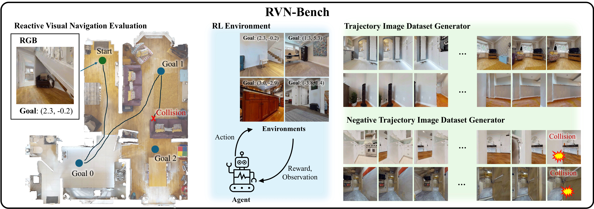

<div align="center">
<h1><center>RVN-Bench

A Benchmark for Reactive Visual Navigation</h1>

Jaewon Lee, Jaeseok Heo, Gunmin Lee, Howoong Jun, Jeongwoo Oh, Songhwai Oh

Seoul National University, Sequor Robotics

<a href='https://arxiv.org/abs/2603.03953'></a> 
<a href='https://rvn-bench.github.io/'></a> 

<p>
    
</p>

</div>

## Overview
**RVN-Bench** is a collision-aware benchmark for **reactive visual navigation** by indoor mobile robots. An agent must reach sequential goal positions in previously unseen environments using only visual observations and no prior map, while avoiding collisions. It is built on the [Habitat 2.0](https://github.com/facebookresearch/habitat-sim) simulator with high-fidelity [HM3D](https://aihabitat.org/datasets/hm3d/) scenes.

This repository provides:
- **Evaluation scenarios** over held-out HM3D scenes, with `train` / `rvn-val` / `rvn-test` splits.
- **An online RL environment** for training reactive navigation policies.
- **A trajectory dataset generator** producing both standard and negative (collision) datasets in the [visualnav-transformer](https://github.com/robodhruv/visualnav-transformer) format.

## Installation
The repo has been tested with Ubuntu 22.04.

### 1. Add HM3D scene dataset
- Download the HM3D dataset at https://aihabitat.org/datasets/hm3d/
- Copy the `hm3d` datasets as follows: `data/scene_datasets/hm3d/{split}/00\d\d\d-{scene}/{scene}.basis.glb`
    - train: `00000-kfPV7w3FaU5`~`00799-deNrXzuSss5`
    - rvn-val: `00800-TEEsavR23oF`~`00849-a8BtkwhxdRV`
    - rvn-test: `00850-W7k2QWzBrFY`~`00899-58NLZxWBSpk`

### 2. Create Env
Install Habitat-Sim (0.3.2)
```bash
conda create -n habitat python=3.9 cmake=3.14.0
conda activate habitat
conda install habitat-sim==0.3.2 withbullet -c conda-forge -c aihabitat
```

Install Habitat-lab (0.3.2)
```bash
git clone --branch v0.3.2 https://github.com/facebookresearch/habitat-lab.git
cd habitat-lab
pip install -e habitat-lab  # install habitat_lab
```

Install dependencies
```bash
pip install torch==2.5.1 torchvision==0.20.1 torchaudio==2.5.1 --index-url https://download.pytorch.org/whl/cu124
```

(Optional) Install habitat-baselines for RL training.

(Optional) Run GNM models
```bash
# Create conda env
conda env create -f environments/nomad_environment.yaml -n habitat_nomad_rl
conda activate habitat_nomad_rl

conda install habitat-sim withbullet -c conda-forge -c aihabitat
cd models/
pip install -e gnms_levin/train/
pip install -e diffusion_policy/

# downgrade huggingface_hub
pip install huggingface_hub==0.25.2
pip install warmup_scheduler
pip install lmdb
pip install prettytable
```

## Trajectory Dataset Collection
Run the following script to collect the trajectory dataset.
```
python scripts/collect_traj_data.py -cp=configs/dataset_collector/train_dataset_collector_f.yaml --seed=2503011350 --save_dir=data/trajectory_datasets -m=discrete
```

Run the following script to collect the negative dataset.
```
python scripts/collect_traj_data.py -cp=configs/dataset_collector/train_dataset_collector_f.yaml --seed=2503011350 --save_dir=data/trajectory_datasets -m=discrete_single_neg
```


### About Trajectory Dataset
Each trajectory folder contains the following:

```
{map_name}_{traj_idx}/
├── #.jpg : Image captured from main camera.
├── #_{camera_name}_{rgb}.jpg : RGB captured from each camera.
├── #_{camera_name}_{depth}.tiff : Depth image captured from each camera (in mm).
├── traj_data.pkl : Pickle file that contains the trajectory
├── data_config.yaml : Configuration file that contains the dataset configuration.
├── global_occupancy_map.png : Image that contains the global occupancy map.
└── global_occupancy_map.yaml : Global occupancy map config file.
```

- traj_data.pkl: 2D position and yaw of the trajectory.
    - {"position": [[x_0, y_0], [x_1, y_1], ...], "yaw": [yaw_0, yaw_1, ...]}
    - it follows the format of the [visualnav-transformer](https://github.com/robodhruv/visualnav-transformer) training dataset.
- data_config.yaml: robot and camera configurations.
- global_occupancy_map.yaml: ROS occupancy map config file.
    - Note that the image (map name) field in this file is INACCURATE (it is set to the original map in assets/scenes/).

## Evaluate Policy in RVN-Bench
(Optional) Download the demo checkpoint (a ResNet-LSTM PPO agent)
```
gh release download v1.0 -p '*.pth' -D agents/weights/
```

To evaluate a policy in RVN-Bench, run
```
python scripts/run_seq_point_goal_nav_exp.py
```
To benchmark a custom agent, create a custom agent inheriting the `agents.agent.Agent` class (e.g. `agents.res_net_policy_agent.ResNetPolicyAgent`) and add the agent in `scripts/run_seq_point_goal_nav_exp.py`.

## Troubleshooting
### OpenGL bug
`habitat_sim` core dumps (`IOT instruction (core dumped)`) at `Loading the scene...` with:
`GL::Context: cannot retrieve OpenGL version: GL::Renderer::Error::InvalidValue`

Cause: conda-forge GL libs shadow the system NVIDIA driver.

Fix: Remove them with
```bash
conda remove --force libglvnd libgl libegl libglx
```
